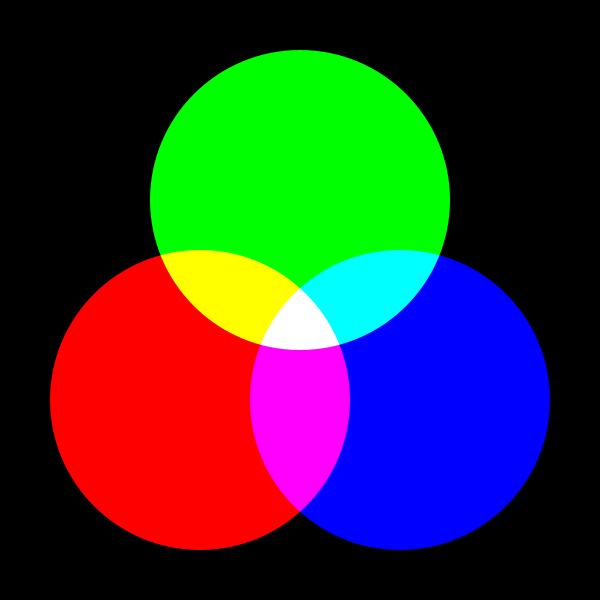
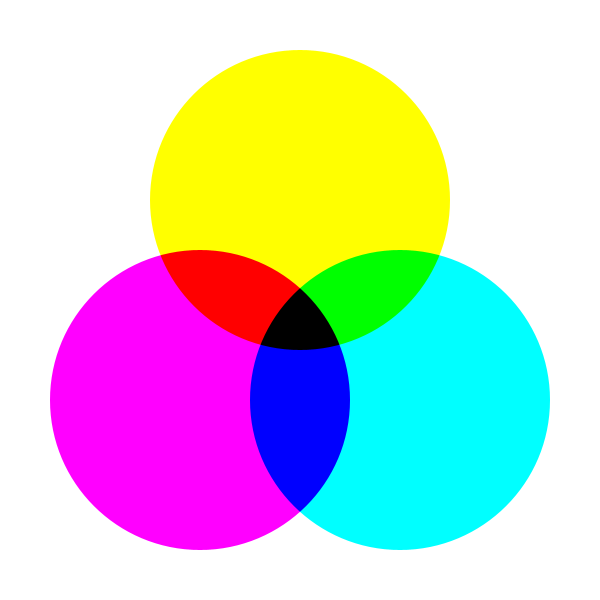

# Blend Mode
Processing の `blendMode` メソッドについて

マニュアルを見てもさっぱり意味がわからない。
いろいろ試してみるとよい。

## アルファ・チャネル
図形を描くとき，透明度を加味して色の合成が行われる。透明度を表すパラメータは alpha-channel と呼ばれ $\alpha$ で表す。
背景色が _B_ で重ねる色が _A_ のとき，アルファ・チャネルが $\alpha$ だと

$$
C = A\cdot\alpha + B\cdot(1-\alpha)
$$

という色になる。ただし $0\leq\alpha\leq1$ とする。つまり線形補間した結果になる。

デフォルトでは &alpha; の最大値は 255 なので，換算して考えること。

## Usage
```java
blendMode(mode)
```

_mode_ ごとに混色方法が変わる。

## BLEND
デフォルトのモード。色を合成する計算式は次のとおり。

$$
C = A\cdot\alpha + B\cdot(1-\alpha)
$$

Processing のリファレンスマニュアルにある $C = A\cdot\alpha + B$ は誤り。

## ADD
$$
C = \min(1, A\cdot\alpha + B)
$$

ただし _A_, _B_, _C_ は 0以上 1以下とする。デフォルトでは，R, G, B 各色 255 が最大値なので，必要に応じて換算が必要である。

要するに`ADD` は，背景色 $B$ に $A\cdot\alpha$ を**加算**するが，上限に達したらそこにとどまるということである。

## SUBTRACT
$$
C = \max(0, B - A\cdot\alpha)
$$

ADD の逆。背景色 $B$ から $A\cdot\alpha$ を**減算**するが，下限に達したらそこにとどまる。

## LIGHTEST
$$
C = \max(A\cdot\alpha, B)
$$

指定色 $A\cdot\alpha$ と背景色 $B$ の明るい方

```Processing
size(600, 600);

translate(width/2, height/2);

noStroke();

background(#000000);
blendMode(LIGHTEST);

fill(#00ff00);
circle(   0, -100, 300);

fill(#ff0000);
circle(-100,  100, 300);

fill(#0000ff);
circle( 100,  100, 300);
```


## DARKEST
$$
C = \min(A\cdot\alpha, B)
$$

指定色 $A\cdot\alpha$ と背景色 $B$ の暗い方

## DIFFERENCE
$$
C = \left|A\cdot\alpha - B\right|
$$

指定色 $A\cdot\alpha$ と背景色 $B$ の差。ネガっぽい色になる。

## EXCLUSION
`DIFFERENCE` に似ているが，コントラストはそこまでキツくない。

## MULTIPLY
乗算により暗くする。絵の具を混ぜたような混色

$$
C = A\cdot\alpha\cdot B
$$

で計算していると思う。

```Processing
size(600, 600);

translate(width/2, height/2);

noStroke();

background(#ffffff);
blendMode(MULTIPLY);

fill(#ffff00);
circle(   0, -100, 300);

fill(#ff00ff);
circle(-100,  100, 300);

fill(#00ffff);
circle( 100,  100, 300);
```



## SCREEN
`MULTIPLY` の補色。照明を重ねたような混色

$$
C = 1 - (1-A)(1-\alpha)(1-B)
$$

で合ってると思う。

```Processing
size(600, 600);

translate(width/2, height/2);
noStroke();

blendMode(SCREEN);
background(#000000);

fill(#00ff00);
circle(   0, -100, 300);

fill(#ff0000);
circle(-100,  100, 300);

fill(#0000ff);
circle( 100,  100, 300);
```


## REPLACE
指定色で置き換える。アルファチャネル $\alpha$ も無視する。
$$
C = A
$$
