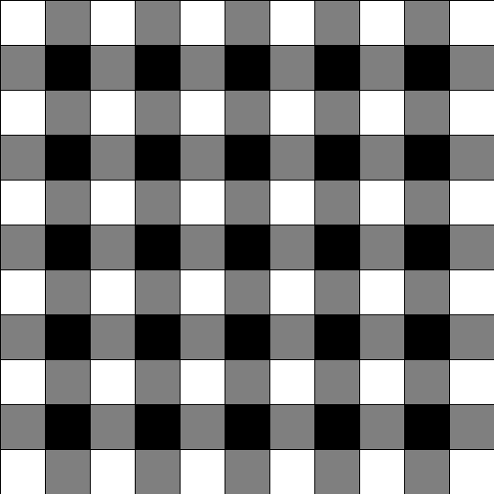
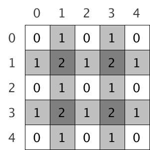
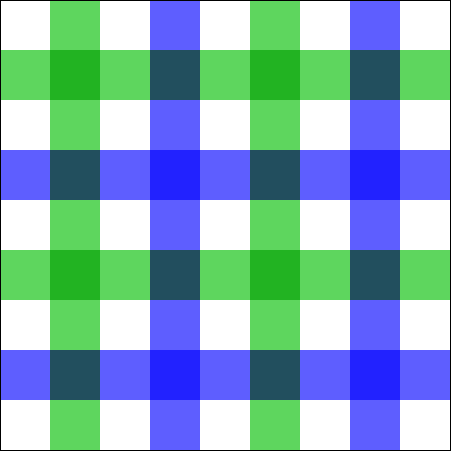

# README

## tartan-mono
Code is [tartan-mono](tartan-mono.pde)

Coloring scheme is illustrated as below. 

## blue and green bands on the white background
The code is [blue-and-green-on-white](blue-and-green-on-white.pde).

