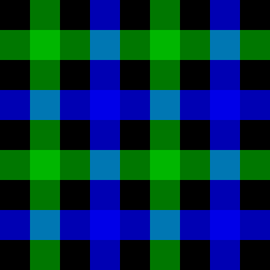

# README

## tartan-mono


[tartan-mono.pde](tartan-mono.pde)
```Processing
size(550, 550);

for (int i = 0; i < 11; i++) {
  for (int j = 0; j < 11; j++) {
    switch ((i % 2) + (j % 2)) {
      case 0: fill(255); break;
      case 1: fill(127); break;
      case 2: fill(0);
    }
    rect(50 * i, 50 * j, 50, 50);
  }
}
```


Coloring scheme is illustrated as below.<br>


## 3色


[blue-and-green-on-white.pde](blue-and-green-on-white.pde).

```Processing
size(550, 550);

background(#ffffff);
noStroke();
blendMode(MULTIPLY);

for (int i = 0; i < 11; i++) {
  if (i % 4 == 1) {
    fill(0, 190, 0, 160);
    rect(0, 50 * i, width, 50);
    rect(50 * i, 0, 50, height);
  }
  else if (i % 4 == 3) {
    fill(0, 0, 255, 160);
    rect(0, 50 * i, width, 50);
    rect(50 * i, 0, 50, height);

  }
}
```

黒地の3色



[blue-and-green-on-black.pde](blue-and-green-on-black.pde).
```Processing
size(450, 450);

background(0);
noStroke();
blendMode(SCREEN);

for (int i = 0; i < 11; i++) {
  if (i % 4 == 1) {
    fill(0, 160, 0, 190);
    rect(0, 50 * i, width, 50);
    rect(50 * i, 0, 50, height);
  }
  else if (i % 4 == 3) {
    fill(0, 0, 240, 190);
    rect(0, 50 * i, width, 50);
    rect(50 * i, 0, 50, height);

  }
  //rect(0, 50 * i, width, 50);
  //rect(50 * i, 0, 50, height);
}
```