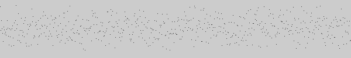
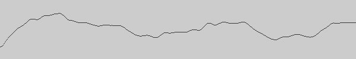
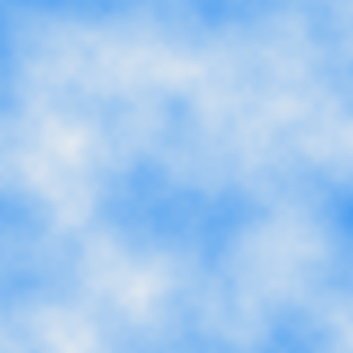

# Perlin Noise

## 導入（パーリン・ノイズとは）
コンピュータグラフィックスの分野では，自然なゆらぎ，自然発生したかのような模様や地形を表現する目的で，
Ken Perlin が考案したパーリンノイズと呼ばれる擬似乱数がよく使用される。
Processingには，パーリンノイズを発生させるために `noise` という関数が用意されている。

| 次元 | 関数 |
|-----|------|
| 1次元 | noise(_x_) |
| 2次元 | noise(_x_, _y_) |
| 3次元 | noise(_x_, _y_, _z_) |

`noise` 関数は次の性質を持つ。
* 0以上 1未満の値を返す
* 返す値は，引数 $x$, $y$, $z$ により定まる
  * ただし `random()` のように，毎回異なる値を返すわけではないが
  * 実行ごとに異なるパーリンノイズ系列が使われる

この説明だけでは何が何やらわからないと思う。実行例を見ながら感覚を掴むとよい。

```Processing
size(600, 100);

for (float x = 0; x < width; x++) {
  point(x, 100 * noise(x));
}
```


$y = \texttt{noise}(x)$ の結果は $0.0 \leqq y < 1.0$ なので，
100倍に拡大して変化がわかるようにした。実行してみると，
ランダムに点を打っているようにしか見えない。



$y$ 軸方向に 100倍拡大しているだからというわけでもないが，$x$ 軸方向にも 100倍拡大してみよう。
$x$ 軸方向に 100倍引き延ばすというのは，$x$ を $100\times x$ に置き換えるのではなく，
逆に $x$ のスピードを $1/100$ に抑えることである。

```Processing
size(600, 100);

for (float x = 0; x < width; x++) {
  point(x, 100 * noise(x / 100));
}
```



この結果を見ると，`noise` 関数の次の性質が浮かんでくる。

* 滑らかに変化する。
* 周期性はない。

この，滑らかだが規則性がわからず変化が予測できないという性質は，
ヒトにとって心地よいランダム性であるため，
コンピュータグラフィックスやコンピュータゲームで多用されている。

## 空模様

2次元の perlin noise を使うと自然にできたような模様が作れる。
次の例は，カラーモードを HSBにし，色相が空色で，`noise` 関数の値により，
彩度が 1.0（空色）から 0.0（白）まで変化する模様である。
どのような模様が出現するか想像力を働かせてからプログラムを入力すると，よく理解できることと思う。

```Processing
size(500, 500);
colorMode(HSB, 360, 1.0, 1.0);

for (float y = 0; y < height; y++) {
  for (float x = 0; x < width; x++) {
    stroke(210, noise(x / 100, y / 100), 1.0);
    point(x, y);
  }
}
```

注意：上のプログラムで _x_, _y_ を float型にしている。
理由は _x_ が int型だと _x_ / 100 は整数除算を実行するので誤った計算になるからである。
つまり $1/100 = 2/100 = \cdots = 99/100 = 0$ となって `noise` 関数の計算結果が変化しない。
もし _x_ を int型にするなら，_x_ / 100 の代わりに _x_ / 100.0 にして，
浮動小数点数除算を実行しなければならない。

ちなみに次のような画像が作られる。




## ランダム・ウォーク

次の2つのプログラムは，
パーリン・ノイズに従ってランダムに動き回る図形のアニメーションである。

```Processing
void setup() {
  size(500, 500);
  colorMode(HSB, 1.0, 1.0, 1.0, 1.0);
}

void draw() {
  float k = frameCount;
  noFill();
  stroke(0, 0, noise(k / 100, 0), 1);
  float x = width * noise(k / 100, 1);
  float y = height * noise(k / 100, 2);
  circle(x, y, 50);
}
```

```Processing
void setup() {
  size(500, 500);
}

void draw() {
  background(0);
  float k = frameCount;
  noFill();
  for (float b = 0; b < 256; b++) {
    stroke(b);
    float x = width * noise((k + b) / 100, 1);
    float y = height * noise((k + b) / 100, 2);
    square(x, y, 50);
  }
}
```

